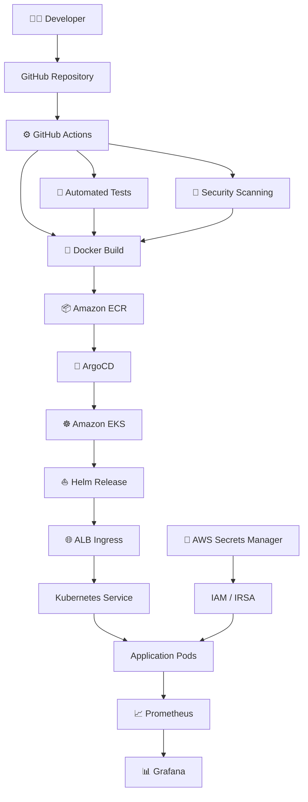
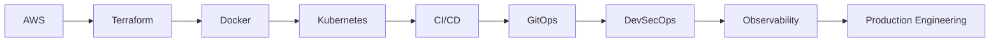

<div align="center">

# 👋 Hi, I'm Harshith Roshan

### ☁️ DevOps & Cloud Engineering


<br/>


<br/>


</div>

---

<div align="center">

[**About**](#about-me) •
[**Tech Stack**](#tech-stack) •
[**Project**](#flagship-project) •
[**Architecture**](#architecture) •
[**Engineering Practices**](#engineering-practices) •
[**GitHub Analytics**](#github-analytics) •
[**Connect**](#connect-with-me)

</div>

---

## About Me

```yaml
name: Harshith Roshan

focus:
  - DevOps Engineering
  - Cloud Computing
  - Infrastructure Automation
  - Kubernetes
  - DevSecOps

currently_building:
  - Production-style AWS Infrastructure
  - CI/CD Pipelines
  - Kubernetes Deployments
  - GitOps Workflows

automation:
  - Python
  - Bash
  - Terraform

cloud:
  provider: AWS

goal:
  "Build secure, automated, observable and scalable systems."
```

- ☁️ Focused on **DevOps & Cloud Engineering**
- 🏗️ Building infrastructure on **AWS using Terraform**
- 🐳 Containerizing applications using **Docker**
- ☸️ Deploying workloads using **Kubernetes & Amazon EKS**
- ⚙️ Building **CI/CD pipelines** with GitHub Actions and Jenkins
- 🔄 Implementing **GitOps with ArgoCD & Helm**
- 🔐 Exploring **DevSecOps, IAM, IRSA & Secrets Management**
- 📊 Working with **Prometheus, Grafana & CloudWatch**
- 🐍 Using **Python & Bash for automation**
- 🌐 Strengthening **Linux, networking and cloud architecture**

---

# Tech Stack

### ☁️ Cloud & Infrastructure

<p align="center">
  
</p>

<div align="center">

`AWS` • `Terraform` • `Linux` • `Infrastructure as Code`

</div>

### 🐳 Containers & Orchestration

<p align="center">
  
</p>

<div align="center">

`Docker` • `Kubernetes` • `Amazon EKS` • `Helm`

</div>

### ⚙️ CI/CD & Version Control

<p align="center">
  
</p>

<div align="center">

`Git` • `GitHub` • `GitHub Actions` • `Jenkins`

</div>

### 💻 Programming & Automation

<p align="center">
  
</p>

<div align="center">

`Python` • `Bash` • `YAML` • `HCL`

</div>

### 🔄 GitOps & Observability

<div align="center">


</div>

---

# AWS Knowledge

<details>
<summary><b>☁️ Compute</b></summary>

<br/>

- Amazon EC2
- Auto Scaling Groups
- Application Load Balancer
- Elastic Beanstalk
- Amazon EKS

</details>

<details>
<summary><b>🌐 Networking</b></summary>

<br/>

- VPC
- Public & Private Subnets
- Route Tables
- Internet Gateway
- NAT Gateway
- Security Groups
- Load Balancers
- DNS fundamentals

</details>

<details>
<summary><b>🔐 Identity & Security</b></summary>

<br/>

- AWS IAM
- IAM Users
- IAM Roles
- IAM Policies
- Instance Profiles
- IRSA
- AWS Secrets Manager
- Security Groups
- Least Privilege Access

</details>

<details>
<summary><b>📦 Containers & Deployment</b></summary>

<br/>

- Amazon ECR
- Amazon EKS
- Docker
- Kubernetes
- Helm
- ArgoCD
- ALB Ingress

</details>

<details>
<summary><b>📊 Monitoring</b></summary>

<br/>

- Amazon CloudWatch
- Prometheus
- Grafana
- Kubernetes health probes
- Application monitoring

</details>

---

# Flagship Project

## 🔐 Production-Grade DevSecOps Cloud Platform

> A cloud-native DevSecOps platform focused on automated infrastructure,
> secure application delivery, GitOps deployment and observability.

### 🎯 Problem

Modern teams need a repeatable way to move application code from:

```text
Developer
      ↓
Source Code
      ↓
Testing
      ↓
Security
      ↓
Container Image
      ↓
Cloud Infrastructure
      ↓
Kubernetes
      ↓
Production Monitoring
```

without depending on repetitive manual deployment steps.

### 💡 Solution

I am building a platform that integrates:

```text
GitHub
   ↓
GitHub Actions
   ↓
Testing + Security
   ↓
Docker
   ↓
Amazon ECR
   ↓
ArgoCD
   ↓
Amazon EKS
   ↓
Prometheus + Grafana
```

---

# Architecture



---

## 🚀 Delivery Pipeline

<div align="center">

**CODE**

⬇️

**GITHUB**

⬇️

**CI / TEST**

⬇️

**SECURITY SCAN**

⬇️

**DOCKER IMAGE**

⬇️

**AMAZON ECR**

⬇️

**ARGOCD**

⬇️

**AMAZON EKS**

⬇️

**MONITORING**

</div>

---

# Engineering Practices

| Area | Practice |
|---|---|
| 🏗️ Infrastructure | Infrastructure as Code using Terraform |
| 🐳 Containers | Immutable Docker images |
| 🔁 CI/CD | Automated build, test and deployment |
| 🔄 GitOps | Git as deployment source of truth |
| 🔐 Security | Least privilege IAM |
| 🔑 Secrets | Externalized secrets management |
| ☸️ Kubernetes | Declarative deployments |
| ❤️ Reliability | Liveness & readiness probes |
| 📊 Monitoring | Metrics using Prometheus & Grafana |
| 📝 Documentation | Architecture and deployment documentation |

---

# How I Approach DevOps

```text
               ┌───────────────┐
               │     CODE      │
               └───────┬───────┘
                       │
                       ▼
               ┌───────────────┐
               │     TEST      │
               └───────┬───────┘
                       │
                       ▼
               ┌───────────────┐
               │    SECURE     │
               └───────┬───────┘
                       │
                       ▼
               ┌───────────────┐
               │     BUILD     │
               └───────┬───────┘
                       │
                       ▼
               ┌───────────────┐
               │    DEPLOY     │
               └───────┬───────┘
                       │
                       ▼
               ┌───────────────┐
               │    OBSERVE    │
               └───────┬───────┘
                       │
                       ▼
               ┌───────────────┐
               │    IMPROVE    │
               └───────────────┘
```

---

# What I'm Currently Building

<details open>
<summary><b>🚀 DevSecOps Cloud Platform</b></summary>

<br/>

### Infrastructure

- Terraform
- AWS VPC
- Public / Private Subnets
- IAM
- EKS
- ECR
- Load Balancing

### Application Delivery

- GitHub Actions
- Docker
- Helm
- ArgoCD

### Security

- IAM Least Privilege
- IRSA
- Secrets Manager
- Container security scanning

### Observability

- Prometheus
- Grafana
- CloudWatch

</details>

---

# DevOps Scenario Knowledge

<details>
<summary><b>☸️ Kubernetes Troubleshooting</b></summary>

<br/>

Topics I work with:

- Pod Pending
- CrashLoopBackOff
- ImagePullBackOff
- Services and selectors
- ClusterIP
- NodePort
- LoadBalancer
- Ingress
- Liveness probes
- Readiness probes
- Service Accounts
- RBAC
- IRSA

</details>

<details>
<summary><b>🌐 AWS Networking</b></summary>

<br/>

Understanding traffic flows such as:

```text
Internet
   ↓
Internet Gateway
   ↓
Public Subnet
   ↓
Application Load Balancer
   ↓
Private Subnet
   ↓
Application
```

and outbound private-subnet traffic:

```text
Private Instance
       ↓
Route Table
       ↓
NAT Gateway
       ↓
Internet Gateway
       ↓
Internet
```

</details>

<details>
<summary><b>⚙️ CI/CD</b></summary>

<br/>

Typical workflow:

```text
git push
   ↓
GitHub Actions
   ↓
Checkout
   ↓
Install Dependencies
   ↓
Run Tests
   ↓
Authenticate to AWS using OIDC
   ↓
Docker Build
   ↓
Tag Image
   ↓
Push to ECR
   ↓
GitOps Deployment
```

</details>

---

# GitHub Analytics

<div align="center">


</div>

<br/>

<div align="center">


</div>

---

## 📈 Contribution Activity

<div align="center">


</div>

---

# Current Learning Roadmap



---

# Engineering Mindset

<div align="center">

### Automate repetitive work.

### Build reproducible infrastructure.

### Secure every layer.

### Observe everything.

### Improve continuously.

</div>

---

# Connect With Me

<div align="center">

<a href="https://github.com/harshithrosun2705-star">
  
</a>

<!--
Replace YOUR_LINKEDIN_USERNAME below with your real LinkedIn username.
Example:
https://www.linkedin.com/in/harshith-roshan/
-->

<a href="https://www.linkedin.com/in/YOUR_LINKEDIN_USERNAME/">
  
</a>

</div>

<br/>

<div align="center">

### ☁️ Cloud • ⚙️ Automate • 🚀 Deploy • 📊 Observe • 🔐 Secure

**Building infrastructure that is reproducible, reliable and scalable.**

</div>
