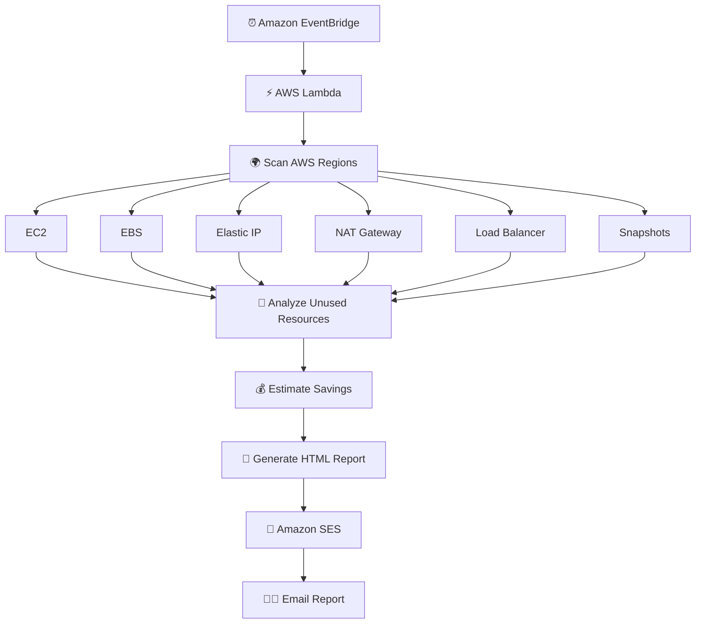
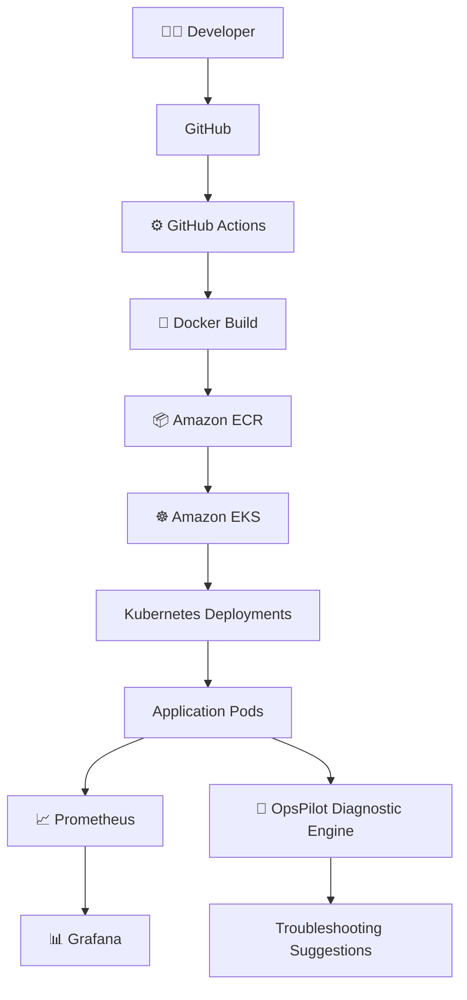
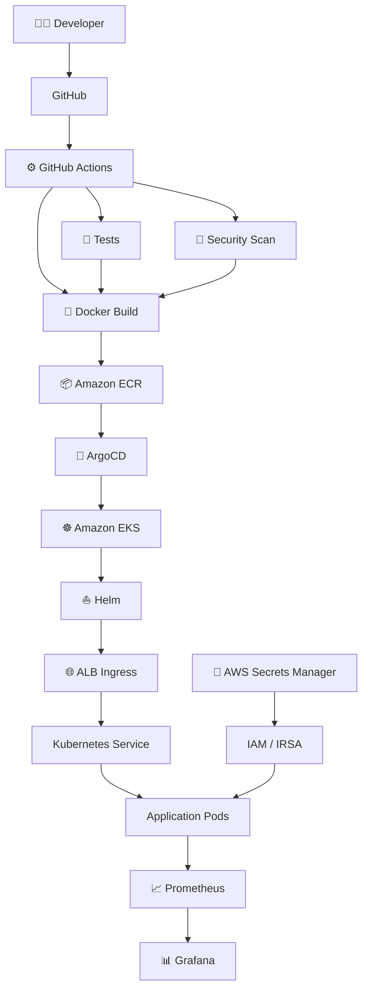
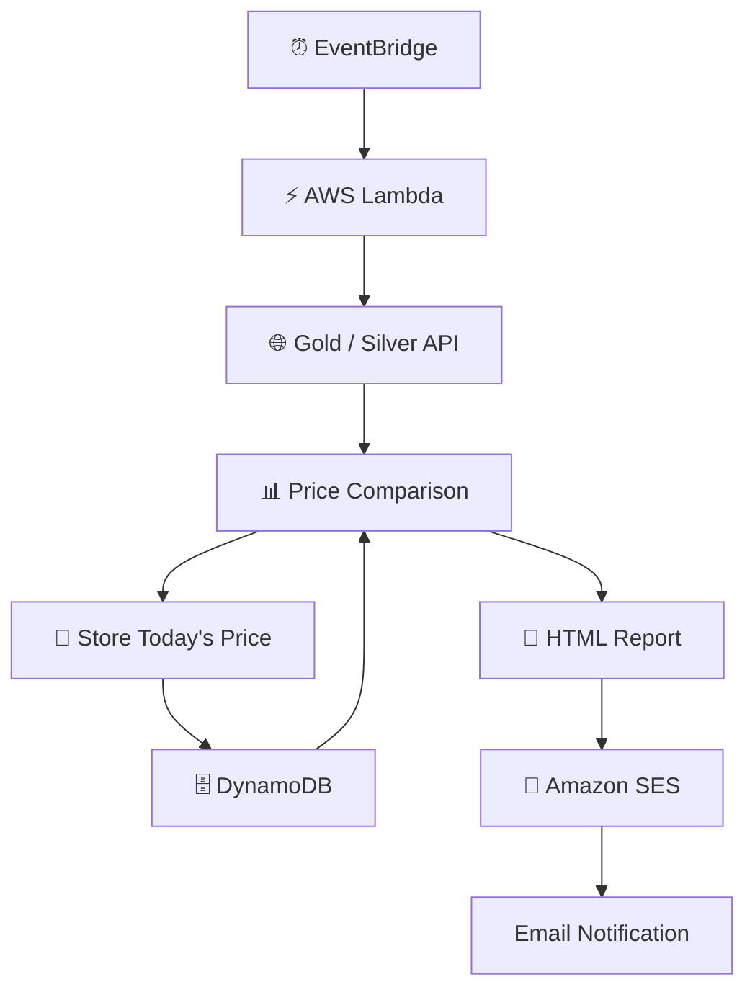
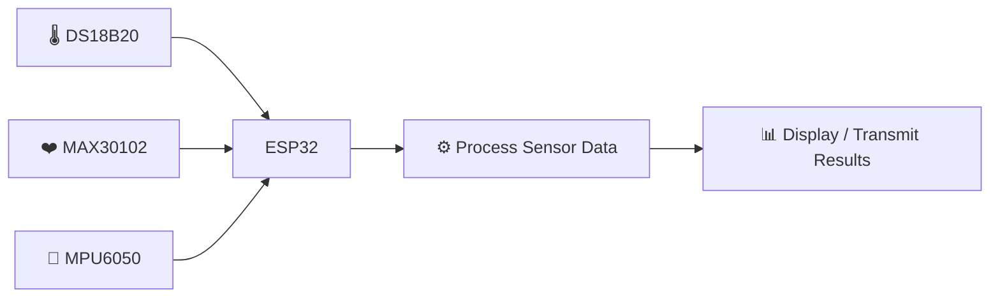
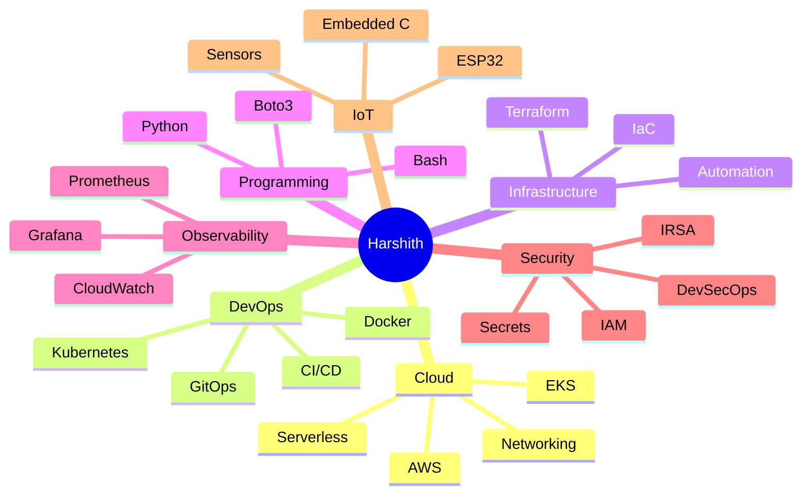

# 🚀 Featured Projects

<div align="center">

### Engineering projects focused on Cloud, DevOps, Automation, Kubernetes, FinOps & IoT

<br/>


</div>

---

## 📌 Project Portfolio

| Project | Domain | Core Technologies |
|---|---|---|
| 💰 **AWS Multi-Region Cost Optimization Platform** | FinOps / Cloud Automation | Lambda, Python, Boto3, SES, EventBridge |
| 🤖 **OpsPilot** | Kubernetes / DevOps / SRE | EKS, Docker, Kubernetes, Prometheus, Grafana |
| 🔐 **DevSecOps Cloud Platform** | DevSecOps / GitOps | Terraform, EKS, ArgoCD, Helm, CI/CD |
| 🪙 **Gold & Silver Price Monitoring System** | Serverless / Automation | Lambda, DynamoDB, SES, Python |
| ❤️ **IoT Health Monitoring System** | IoT / Embedded | ESP32, MAX30102, MPU6050, Embedded C |

---

# ⭐ 01 — AWS Multi-Region Cost Optimization Platform

> **Serverless FinOps automation that discovers unused AWS resources across multiple regions and estimates potential monthly cloud savings.**

<div align="center">


</div>

<details open>
<summary><b>💡 Click to explore the project</b></summary>

<br/>

### 🎯 Problem

Unused cloud resources can continue generating costs even when they are no longer providing business value.

Manually checking every AWS region for unused infrastructure is repetitive and error-prone.

### 💡 Solution

I built a **serverless AWS cost optimization monitoring system** that automatically scans configured AWS regions, identifies potentially unused resources, estimates monthly savings and sends a consolidated HTML report through email.

### 🏗️ Architecture



### 🔍 Resources Monitored

- Stopped EC2 instances
- Unattached EBS volumes
- Old EBS snapshots
- Unused Elastic IP addresses
- Potentially idle NAT Gateways
- Potentially idle Load Balancers

### ⚙️ Execution Flow

```text
EventBridge
      │
      ▼
AWS Lambda
      │
      ▼
Discover Enabled Regions
      │
      ▼
Scan Resources
      │
      ▼
Detect Unused Infrastructure
      │
      ▼
Estimate Monthly Savings
      │
      ▼
Generate HTML Report
      │
      ▼
Amazon SES
      │
      ▼
Email Notification
```

### 🧠 Automation Logic

Example regional client creation:

```python
for region in regions:
    ec2 = boto3.client("ec2", region_name=region)
```

Example EBS cost estimation:

```text
Unused EBS Volume

Size = 100 GB
Estimated rate = $0.08 / GB

Estimated saving:

100 × $0.08
= $8 / month
```

### 📧 Generated Report

The automated report contains information such as:

| Region | Resource | Finding | Estimated Saving | Recommendation |
|---|---|---|---:|---|
| us-east-1 | EBS | Unattached volume | Estimated | Review / Delete |
| ap-south-1 | EC2 | Stopped instance | Estimated | Review |
| eu-west-1 | EIP | Unassociated IP | Estimated | Release |

### 🧰 Technologies

`AWS Lambda`
`EventBridge`
`CloudWatch`
`Amazon SES`
`AWS IAM`
`Python`
`Boto3`

### 🎯 Skills Demonstrated

- AWS Serverless Architecture
- Python Automation
- Boto3
- Multi-region AWS operations
- Cloud Cost Optimization
- FinOps fundamentals
- IAM permissions
- Event-driven architecture
- HTML report generation
- Automated cloud auditing

</details>

---

# 🤖 02 — OpsPilot

## Kubernetes Self-Healing & AI-Assisted Microservices Platform

> **A Kubernetes operations platform combining container orchestration, CI/CD, monitoring, automatic workload recovery and intelligent troubleshooting.**

<div align="center">


</div>

<details>
<summary><b>☸️ Click to explore OpsPilot</b></summary>

<br/>

### 🎯 Problem

Running microservices in Kubernetes requires more than simply creating Pods.

Teams must be able to:

- Deploy applications automatically
- Detect failures
- Recover workloads
- Monitor infrastructure
- Understand Kubernetes errors quickly

### 💡 Solution

**OpsPilot** deploys containerized microservices on Amazon EKS with CI/CD, Kubernetes self-healing, Prometheus/Grafana monitoring and automated troubleshooting assistance.

### 🏗️ Architecture



### 🧩 Microservices

```text
                    ┌─────────────────┐
                    │     Frontend    │
                    │      Nginx      │
                    └────────┬────────┘
                             │
              ┌──────────────┼──────────────┐
              │              │              │
              ▼              ▼              ▼
        Auth Service    Task Service    Order Service
          FastAPI          API              API
```

### ⚙️ CI/CD Flow

```text
Developer
    │
    ▼
git push
    │
    ▼
GitHub Actions
    │
    ├── Build Docker Image
    │
    └── Push Image
    │
    ▼
Amazon ECR
    │
    ▼
Amazon EKS
```

### ❤️ Kubernetes Self-Healing

Suppose the desired state is:

```text
Desired Pods = 3
```

One Pod crashes:

```text
Current Healthy Pods = 2
```

Kubernetes compares:

```text
Desired State = 3
Actual State  = 2
```

The ReplicaSet controller creates another Pod:

```text
2 Pods
   ↓
ReplicaSet detects difference
   ↓
New Pod created
   ↓
3 Pods running again
```

### 📊 Monitoring

Prometheus collects information including:

- CPU utilization
- Memory usage
- Pod availability
- Pod restart count
- Application metrics

Grafana provides visualization through dashboards.

### 🤖 Troubleshooting Component

The diagnostic component uses the **Kubernetes Python SDK** to inspect workload state.

It can analyze conditions including:

```text
CrashLoopBackOff
ImagePullBackOff
Pending
ContainerCreating
Pod failures
Restart loops
```

and provide troubleshooting guidance based on the detected state.

Example:

```text
Detected:
ImagePullBackOff

Possible checks:
→ Verify image name
→ Verify image tag
→ Verify ECR authentication
→ Verify imagePullSecrets / IAM configuration
```

### 🧰 Technologies

`AWS EKS`
`Amazon ECR`
`Docker`
`Kubernetes`
`GitHub Actions`
`Prometheus`
`Grafana`
`FastAPI`
`Nginx`
`Python`
`Kubernetes Python SDK`

### 🎯 Skills Demonstrated

- Kubernetes architecture
- AWS EKS
- Containerization
- Microservices
- CI/CD
- Monitoring
- Kubernetes troubleshooting
- Self-healing workloads
- Python automation
- Cloud-native application deployment

</details>

---

# 🔐 03 — Production-Grade DevSecOps Cloud Platform

> **Secure cloud-native application delivery using Infrastructure as Code, CI/CD, GitOps, Kubernetes and observability.**

<div align="center">


</div>

<details>
<summary><b>🔐 Click to explore the DevSecOps platform</b></summary>

<br/>

### 🎯 Objective

Design a production-style DevSecOps workflow where infrastructure, security and application delivery are automated.

### 🏗️ Architecture



### 🚀 Delivery Flow

```text
CODE
 │
 ▼
GITHUB
 │
 ▼
CI / TEST
 │
 ▼
SECURITY
 │
 ▼
DOCKER
 │
 ▼
ECR
 │
 ▼
ARGOCD
 │
 ▼
EKS
 │
 ▼
MONITORING
```

### 🔐 Security Concepts

- IAM least privilege
- IRSA
- AWS Secrets Manager
- Container security scanning
- CI/CD security gates
- Private workloads
- Infrastructure as Code

### 🧰 Technologies

`AWS`
`Terraform`
`Docker`
`Kubernetes`
`Amazon EKS`
`Amazon ECR`
`GitHub Actions`
`ArgoCD`
`Helm`
`Prometheus`
`Grafana`

</details>

---

# 🪙 04 — Gold & Silver Price Monitoring System

> **Serverless AWS automation that collects precious-metal prices, stores historical records, compares daily changes and automatically emails reports.**

<div align="center">


</div>

<details>
<summary><b>🪙 Click to explore the serverless monitoring system</b></summary>

<br/>

### 🎯 Problem

Tracking daily Gold and Silver prices manually makes it difficult to immediately identify price movements and maintain historical records.

### 💡 Solution

I built an automated serverless pipeline that:

1. Fetches market prices
2. Retrieves the previous day's data
3. Calculates the difference
4. Stores today's data
5. Generates an HTML report
6. Emails the report automatically

### 🏗️ Architecture



### 🔄 Processing Flow

```text
EventBridge
     │
     ▼
Lambda
     │
     ▼
External Price API
     │
     ▼
Read Previous Price
     │
     ▼
Compare Values
     │
     ▼
Store Today's Data
     │
     ▼
Generate HTML Report
     │
     ▼
SES Email
```

### 📊 Values Processed

- Gold — 1 gram
- Gold — 8 grams
- Silver — 1 gram

Example comparison:

```text
Today's Price      ₹X
Yesterday's Price  ₹Y
                    │
                    ▼
Difference          ₹X - ₹Y
                    │
                    ▼
Increase / Decrease
```

### 🧰 Technologies

`AWS Lambda`
`Amazon DynamoDB`
`Amazon SES`
`Amazon EventBridge`
`Amazon CloudWatch`
`Python`
`Boto3`
`urllib3`
`REST API`

### 🎯 Skills Demonstrated

- Serverless architecture
- Lambda
- DynamoDB
- REST API integration
- Python automation
- Event-driven systems
- Data persistence
- Automated reporting
- Email notifications

</details>

---

# ❤️ 05 — IoT Health Monitoring System

> **Sensor-based IoT system designed to capture and process health and motion information using an ESP32.**

<div align="center">


</div>

<details>
<summary><b>❤️ Click to explore the IoT system</b></summary>

<br/>

### 🎯 Objective

Build an embedded monitoring system capable of collecting health and motion-related sensor data in real time.

### 🏗️ Architecture



### 🔬 Sensors

#### 🌡️ DS18B20

Used for:

```text
Body Temperature
```

#### ❤️ MAX30102

Used for:

```text
Heart Rate
SpO₂
```

#### 🏃 MPU6050

Used for:

```text
Motion Detection
Fall Detection
```

### ⚙️ Data Flow

```text
Sensors
   │
   ▼
ESP32
   │
   ▼
Read Raw Values
   │
   ▼
Process Sensor Data
   │
   ▼
Generate Measurements
   │
   ▼
Display / Transmit Results
```

### 🧰 Technologies

`ESP32`
`DS18B20`
`MAX30102`
`MPU6050`
`Arduino IDE`
`Embedded C`

### 🎯 Skills Demonstrated

- Embedded systems
- IoT architecture
- Sensor integration
- Microcontroller programming
- Hardware/software integration
- Real-time data acquisition

</details>

---

# 🧠 What These Projects Demonstrate

<div align="center">

| ☁️ Cloud | ⚙️ DevOps | 🐍 Automation | 🔐 Security | 📊 Monitoring |
|---|---|---|---|---|
| AWS | CI/CD | Python | IAM | Prometheus |
| Serverless | GitHub Actions | Boto3 | IRSA | Grafana |
| EKS | Docker | API Integration | Secrets | CloudWatch |
| DynamoDB | Kubernetes | Event Automation | DevSecOps | Metrics |

</div>

---

# 🏗️ Engineering Domains



---

# ⚙️ Engineering Practices

| Area | Practice |
|---|---|
| 🏗️ Infrastructure | Infrastructure as Code |
| ☁️ Cloud | AWS architecture |
| 🐍 Automation | Python & Boto3 |
| 🐳 Containers | Docker |
| ☸️ Orchestration | Kubernetes |
| 🔁 CI/CD | Automated build and delivery |
| 🔄 GitOps | Declarative deployments |
| 🔐 Security | Least privilege IAM |
| 🔑 Secrets | External secrets management |
| ❤️ Reliability | Kubernetes self-healing & probes |
| 📊 Observability | Metrics and dashboards |
| 💰 FinOps | Cloud cost optimization |
| ⚡ Serverless | Event-driven AWS architectures |
| 📝 Documentation | Architecture and implementation documentation |

---

## 🎯 Project Focus

<div align="center">

```text
                    HARSHITH'S ENGINEERING PORTFOLIO

                              ☁️ AWS
                                │
                ┌───────────────┼───────────────┐
                │               │               │
                ▼               ▼               ▼
            DEVOPS          SERVERLESS        FINOPS
                │               │               │
                ▼               ▼               ▼
         Kubernetes/EKS      Lambda        Cost Optimizer
                │               │
                ▼               ▼
           CI/CD/GitOps      DynamoDB
                │
                ▼
         Monitoring/Security

                     + Python Automation

                     + IoT / Embedded
```

</div>
