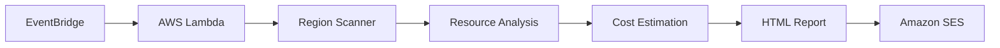
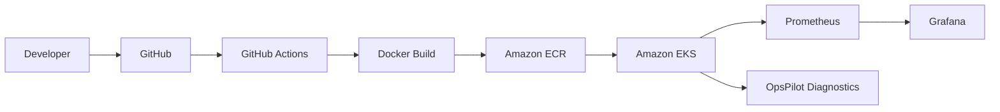
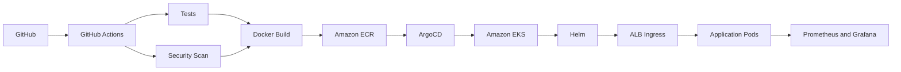
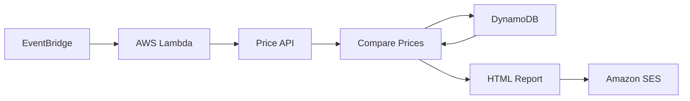
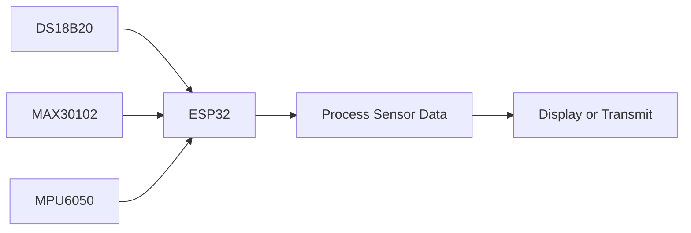
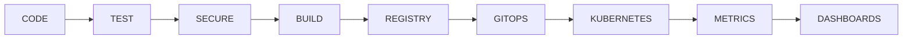

<!-- ========================================================= -->
<!--                 HARSHITH ROSUN W                          -->
<!--          DEVOPS • CLOUD • AUTOMATION                     -->
<!-- ========================================================= -->

<p align="center">
  
</p>

<div align="center">


<br/><br/>

<a href="https://github.com/harshithrosun2705-star">
  
</a>

<a href="https://www.linkedin.com/in/harshith-rosun-w-a3a29a305/">
  
</a>


</div>

<br/>

<!-- ================= NAVIGATION ================= -->

<div align="center">

### `~/navigate`

[⚡ Me](#identity) •
[🛠 Stack](#stack) •
[🚀 Projects](#projects) •
[⚙️ Pipeline](#pipeline) •
[📡 Live Stats](#stats) •
[🌐 Map](#engineering-map) •
[🤝 Connect](#connect)

</div>

---

<a id="identity"></a>

# ⚡ Hey, I'm Harshith

```console
harshith@cloud:~$ whoami

HARSHITH ROSUN W

harshith@cloud:~$ current-focus

☁️  AWS Cloud
🏗️  Terraform
🐳  Docker
☸️  Kubernetes
⚙️  CI/CD
🔄  GitOps
🔐  DevSecOps
📊  Observability
🐍  Python Automation

harshith@cloud:~$ mission

Build → Automate → Secure → Deploy → Observe → Improve
```

<div align="center">

### I enjoy turning this...

`manual setup` → `repeatable infrastructure`

`code` → `automated pipelines`

`containers` → `reliable workloads`

`cloud bills` → `actionable insights`

`errors` → `observable systems`

</div>

---

<a id="stack"></a>

# 🛠 My Toolbox

<div align="center">


<br/><br/>


<br/>


</div>

<br/>

<details>
<summary><b>☁️ AWS</b> — click to expand</summary>

<br/>

```text
AWS
│
├── Compute
│   ├── EC2
│   ├── Lambda
│   ├── Auto Scaling
│   └── EKS
│
├── Networking
│   ├── VPC
│   ├── Public / Private Subnets
│   ├── Route Tables
│   ├── Internet Gateway
│   ├── NAT Gateway
│   ├── Security Groups
│   └── Application Load Balancer
│
├── Containers
│   ├── EKS
│   └── ECR
│
├── Security
│   ├── IAM
│   ├── IAM Roles
│   ├── IAM Policies
│   ├── IRSA
│   └── Secrets Manager
│
└── Serverless / Monitoring
    ├── Lambda
    ├── EventBridge
    ├── SES
    ├── DynamoDB
    └── CloudWatch
```

</details>

<details>
<summary><b>☸️ Kubernetes</b> — click to expand</summary>

<br/>

```text
Kubernetes
│
├── Pods
├── Deployments
├── ReplicaSets
├── Services
├── Ingress
├── ConfigMaps
├── Secrets
├── Service Accounts
├── RBAC
├── Liveness Probes
├── Readiness Probes
└── Self-Healing

Cloud Native
│
├── Amazon EKS
├── Amazon ECR
├── Helm
└── ArgoCD
```

</details>

<details>
<summary><b>⚙️ DevOps</b> — click to expand</summary>

<br/>

```text
Version Control
└── Git + GitHub

CI/CD
├── GitHub Actions
└── Jenkins

Infrastructure as Code
└── Terraform

Containers
└── Docker

GitOps
├── ArgoCD
└── Helm

Automation
├── Python
├── Bash
└── Boto3
```

</details>

<details>
<summary><b>📊 Observability</b> — click to expand</summary>

<br/>

```text
APPLICATION / CLUSTER
        │
        ├── Prometheus
        │      └── Metrics
        │
        ├── Grafana
        │      └── Dashboards
        │
        └── CloudWatch
               └── AWS Monitoring
```

</details>

---

<a id="projects"></a>

# 🚀 Things I've Built

<div align="center">

### Real problems. Real automation. Real cloud.

`AWS` • `Kubernetes` • `FinOps` • `Serverless` • `DevSecOps` • `IoT`

</div>

<br/>

<!-- ================= PROJECT 1 ================= -->

<details open>

<summary>
<b>💰 AWS Multi-Region Cost Optimization Platform</b> ⭐
</summary>

<br/>

> Serverless FinOps automation that scans AWS regions for potentially unused resources and turns them into actionable cost insights.

<div align="center">


</div>

### How it flows



### What it checks

```text
🌍 AWS Regions
   │
   ├── Stopped EC2 Instances
   ├── Unattached EBS Volumes
   ├── Old EBS Snapshots
   ├── Unused Elastic IPs
   ├── Idle NAT Gateways
   └── Idle Load Balancers
```

### What I worked with

`AWS Lambda` `EventBridge` `CloudWatch` `SES` `IAM`

`Python` `Boto3` `FinOps` `HTML Reporting`

### Why I built it

Cloud resources are easy to create but also easy to forget.

The goal was to automate the boring part:

```text
SCAN → FIND → ESTIMATE → REPORT → NOTIFY
```

</details>

---

<!-- ================= PROJECT 2 ================= -->

<details>

<summary>
<b>🤖 OpsPilot</b> — Kubernetes Self-Healing & Troubleshooting
</summary>

<br/>

> A Kubernetes operations project combining microservices, CI/CD, monitoring, workload recovery and automated troubleshooting guidance.

<div align="center">


</div>

### Platform flow



### Microservices

```text
                      NGINX
                    FRONTEND
                        │
         ┌──────────────┼──────────────┐
         │              │              │
         ▼              ▼              ▼
   AUTH SERVICE    TASK SERVICE    ORDER SERVICE
      FastAPI
```

### Self-healing idea

```text
Desired Pods = 3
Actual Pods  = 2

       │
       ▼

ReplicaSet notices the difference

       │
       ▼

Replacement Pod created

       │
       ▼

Actual Pods = 3 ✓
```

### OpsPilot troubleshooting

```text
CrashLoopBackOff
├── inspect logs
├── inspect exit code
├── verify environment
└── verify probes

ImagePullBackOff
├── verify image
├── verify tag
├── verify ECR permissions
└── verify authentication

Pending
├── inspect node capacity
├── inspect resource requests
├── inspect node selector
└── inspect scheduler events
```

### Stack

`AWS EKS` `ECR` `Docker` `Kubernetes`

`GitHub Actions` `Prometheus` `Grafana`

`FastAPI` `Nginx` `Python` `Kubernetes Python SDK`

</details>

---

<!-- ================= PROJECT 3 ================= -->

<details>

<summary>
<b>🔐 Production DevSecOps Cloud Platform</b>
</summary>

<br/>

> A cloud-native delivery platform connecting Infrastructure as Code, CI/CD, GitOps, Kubernetes, security and observability.

<div align="center">


</div>

### Delivery architecture



### Pipeline

```text
CODE
 │
 ▼
TEST
 │
 ▼
SECURITY
 │
 ▼
BUILD
 │
 ▼
ECR
 │
 ▼
ARGOCD
 │
 ▼
EKS
 │
 ▼
HELM
 │
 ▼
APPLICATION
 │
 ▼
OBSERVABILITY
```

### Security focus

```text
IAM Least Privilege
IRSA
AWS Secrets Manager
Container Security
CI/CD Security Gates
Infrastructure as Code
```

### Stack

`AWS` `Terraform` `Docker` `Kubernetes`

`EKS` `ECR` `GitHub Actions`

`ArgoCD` `Helm` `Prometheus` `Grafana`

</details>

---

<!-- ================= PROJECT 4 ================= -->

<details>

<summary>
<b>🪙 Gold & Silver Price Monitoring System</b>
</summary>

<br/>

> A serverless AWS workflow that collects daily prices, compares historical data and automatically emails the result.

<div align="center">


</div>

### Architecture



### Daily flow

```text
FETCH TODAY
    │
    ▼
READ YESTERDAY
    │
    ▼
COMPARE
    │
    ▼
STORE TODAY
    │
    ▼
CREATE REPORT
    │
    ▼
SEND EMAIL
```

### Stack

`Lambda` `DynamoDB` `SES` `EventBridge`

`CloudWatch` `Python` `Boto3` `REST API`

</details>

---

<!-- ================= PROJECT 5 ================= -->

<details>

<summary>
<b>❤️ IoT Health Monitoring System</b>
</summary>

<br/>

> ESP32-based sensor system for health and motion-related data acquisition.

<div align="center">


</div>

### Sensor architecture



### Sensors

```text
DS18B20
└── Temperature

MAX30102
├── Heart Rate
└── SpO2

MPU6050
├── Motion
└── Fall Detection
```

### Stack

`ESP32` `DS18B20` `MAX30102`

`MPU6050` `Arduino IDE` `Embedded C`

</details>

---

<div align="center">

### Want to see the code?

<a href="https://github.com/harshithrosun2705-star?tab=repositories">
  
</a>

</div>

---

<a id="pipeline"></a>

# ⚙️ My DevOps Loop

<div align="center">

### What happens after `git push`?

</div>



<div align="center">

### `CODE → TEST → SECURE → BUILD → SHIP → DEPLOY → OBSERVE`

</div>

<br/>

```console
harshith@devops:~$ principles

01  Automate repetitive work
02  Make infrastructure reproducible
03  Keep desired state in Git
04  Shift security into the pipeline
05  Make systems observable
06  Detect failures quickly
07  Automate recovery where possible
08  Document what I build
```

---

<a id="engineering-map"></a>

# 🌐 Engineering Map

> One picture of the areas I'm building around.

```mermaid
flowchart TB
    ROOT["HARSHITH ROSUN W"]

    ROOT --> A["AWS Cloud"]
    ROOT --> B["DevOps"]
    ROOT --> C["Infrastructure"]
    ROOT --> D["Containers"]
    ROOT --> E["Observability"]
    ROOT --> F["Security"]
    ROOT --> G["Automation"]

    A --> A1["EC2"]
    A --> A2["Lambda"]
    A --> A3["EKS"]
    A --> A4["Networking"]

    B --> B1["CI/CD"]
    B --> B2["GitHub Actions"]
    B --> B3["Jenkins"]
    B --> B4["GitOps"]

    C --> C1["Terraform"]
    C --> C2["Infrastructure as Code"]

    D --> D1["Docker"]
    D --> D2["Kubernetes"]
    D --> D3["Helm"]

    E --> E1["Prometheus"]
    E --> E2["Grafana"]
    E --> E3["CloudWatch"]

    F --> F1["IAM"]
    F --> F2["IRSA"]
    F --> F3["Secrets"]
    F --> F4["DevSecOps"]

    G --> G1["Python"]
    G --> G2["Bash"]
    G --> G3["Boto3"]
```



---

<a id="stats"></a>

# 📡 Live GitHub Telemetry

<div align="center">


<br/><br/>


<br/><br/>


</div>

---

## 📈 Activity Stream

<div align="center">


</div>

---

## 🔭 Right Now

```yaml
name: HARSHITH ROSUN W

building:
  - Cloud Infrastructure
  - DevOps Automation
  - Kubernetes Platforms

cloud:
  - AWS

infrastructure:
  - Terraform

containers:
  - Docker
  - Kubernetes
  - Amazon EKS

delivery:
  - GitHub Actions
  - Jenkins
  - ArgoCD
  - Helm

observability:
  - Prometheus
  - Grafana
  - CloudWatch

security:
  - IAM
  - IRSA
  - Secrets Manager
  - DevSecOps

automation:
  - Python
  - Bash
  - Boto3
```

---

<a id="connect"></a>

# 🤝 Let's Connect

<div align="center">

### Cloud, DevOps, Kubernetes, automation — that's my space.

<br/>

<a href="https://www.linkedin.com/in/harshith-rosun-w-a3a29a305/">
  
</a>

<a href="https://github.com/harshithrosun2705-star">
  
</a>

<br/><br/>

### `BUILD • AUTOMATE • DEPLOY • OBSERVE • IMPROVE`

</div>

<p align="center">
  
</p>
