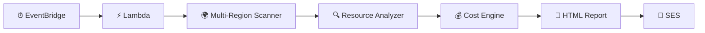
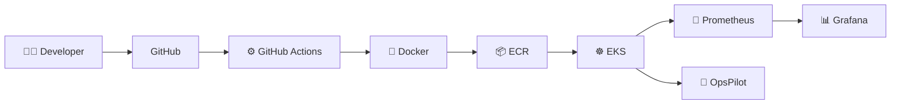
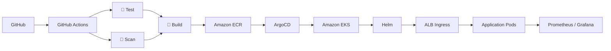
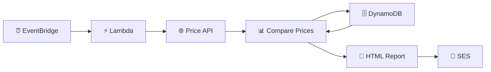
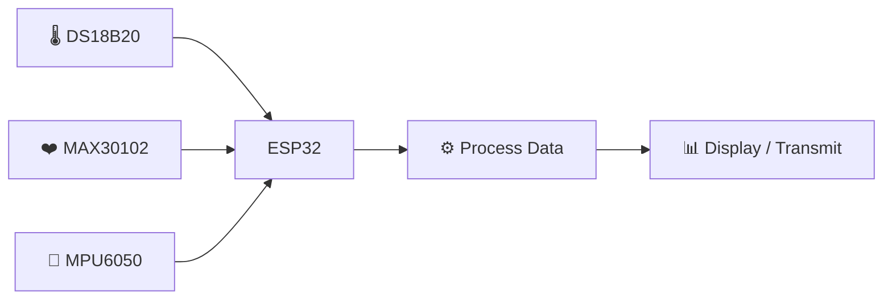

<!-- ===================================================== -->
<!--                 HARSHITH ROSUN W                      -->
<!--            DEVOPS • CLOUD • AUTOMATION                -->
<!-- ===================================================== -->

<!-- ================= HERO ================= -->

<p align="center">
  
</p>

<div align="center">


<br/>

<a href="https://github.com/harshithrosun2705-star">
  
</a>

<a href="https://www.linkedin.com/in/harshith-rosun-w-a3a29a305/">
  
</a>


</div>

---

<div align="center">

### `./navigate`

[⚡ Identity](#-system-identity) •
[🛠 Stack](#-technology-arsenal) •
[🚀 Projects](#-mission-control) •
[⚙️ DevOps](#️-devops-engine) •
[📡 Stats](#-live-github-telemetry) •
[🐍 Activity](#-contribution-stream) •
[🤝 Connect](#-establish-connection)

</div>

---

# ⚡ System Identity

```console
harshith@devops:~$ whoami

HARSHITH ROSUN W

Role:
DevOps & Cloud Engineering

harshith@devops:~$ cat focus.txt

☁️  AWS Cloud
🏗️  Infrastructure as Code
🐳  Docker
☸️  Kubernetes
⚙️  CI/CD
🔄  GitOps
🔐  DevSecOps
📊  Observability
🐍  Python Automation

harshith@devops:~$ echo $MISSION

"Build infrastructure that is
 automated,
 reproducible,
 observable,
 secure
 and scalable."
```

<div align="center">

### From `git push` → `production`

</div>

```text
CODE
 │
 ▼
TEST
 │
 ▼
SECURE
 │
 ▼
BUILD
 │
 ▼
SHIP
 │
 ▼
DEPLOY
 │
 ▼
OBSERVE
 │
 ▼
IMPROVE
 └────────────────────► ♻️
```

---

# 🛠 Technology Arsenal

<div align="center">

### ☁️ Cloud • 🏗 Infrastructure • 🐳 Containers • ⚙️ Automation

<br/>


<br/><br/>


<br/>


</div>

<br/>

<details>
<summary><b>☁️ AWS Cloud Stack</b></summary>

<br/>

```text
AWS
│
├── Compute
│   ├── EC2
│   ├── Lambda
│   ├── Auto Scaling
│   └── EKS
│
├── Networking
│   ├── VPC
│   ├── Public Subnet
│   ├── Private Subnet
│   ├── Route Tables
│   ├── Internet Gateway
│   ├── NAT Gateway
│   ├── Security Groups
│   └── Application Load Balancer
│
├── Data / Storage
│   ├── EBS
│   ├── ECR
│   └── DynamoDB
│
├── Security
│   ├── IAM
│   ├── IAM Roles
│   ├── IAM Policies
│   ├── IRSA
│   └── Secrets Manager
│
└── Automation / Monitoring
    ├── EventBridge
    ├── SES
    ├── CloudWatch
    └── Lambda
```

</details>

<details>
<summary><b>☸️ Kubernetes & Cloud Native</b></summary>

<br/>

```text
Kubernetes
│
├── Pods
├── Deployments
├── ReplicaSets
├── Services
├── ConfigMaps
├── Secrets
├── Ingress
├── Service Accounts
├── RBAC
├── Liveness Probes
├── Readiness Probes
└── Self-Healing

Platform
│
├── Amazon EKS
├── Amazon ECR
├── Helm
└── ArgoCD
```

</details>

<details>
<summary><b>⚙️ CI/CD & Automation</b></summary>

<br/>

```text
Source Control
└── Git / GitHub

CI/CD
├── GitHub Actions
└── Jenkins

Containers
└── Docker

Infrastructure
└── Terraform

GitOps
└── ArgoCD

Automation
├── Python
├── Bash
└── Boto3
```

</details>

<details>
<summary><b>📊 Observability</b></summary>

<br/>

```text
APPLICATION
     │
     ├────────► Prometheus
     │               │
     │               ▼
     │            Metrics
     │
     ├────────► Grafana
     │               │
     │               ▼
     │           Dashboards
     │
     └────────► CloudWatch
                     │
                     ▼
                AWS Monitoring
```

</details>

---

# 🚀 Mission Control

<div align="center">

## Featured Engineering Projects

`CLOUD` • `DEVOPS` • `KUBERNETES` • `FINOPS` • `SERVERLESS` • `AUTOMATION`

</div>

---

<details open>

<summary>

## 💰 01 · AWS Multi-Region Cost Optimization Platform ⭐

**FinOps • AWS Serverless • Python Automation**

</summary>

<br/>

<div align="center">


</div>

### `> mission`

Automatically scan AWS regions, identify potentially unused resources, estimate monthly savings and deliver an HTML optimization report.

### `> architecture`



### `> scanner.targets`

```text
AWS REGIONS
│
├── EC2 Instances
├── EBS Volumes
├── EBS Snapshots
├── Elastic IPs
├── NAT Gateways
└── Load Balancers
```

### `> detection.engine`

```text
Stopped EC2
      ↓
Potential unnecessary compute cost

Unattached EBS
      ↓
Potential storage saving

Old Snapshots
      ↓
Review retention

Unused Elastic IP
      ↓
Potential release

Idle NAT Gateway
      ↓
Review networking cost

Idle Load Balancer
      ↓
Review unused infrastructure
```

### `> execution`

```text
EVENTBRIDGE
     │
     ▼
AWS LAMBDA
     │
     ▼
SCAN AWS REGIONS
     │
     ▼
RESOURCE ANALYSIS
     │
     ▼
COST ESTIMATION
     │
     ▼
HTML REPORT
     │
     ▼
SES EMAIL
```

### `> stack`

`AWS Lambda`
`EventBridge`
`CloudWatch`
`SES`
`IAM`
`Python`
`Boto3`
`FinOps`

### `> demonstrated`

✅ Multi-region AWS automation  
✅ Serverless architecture  
✅ Cloud cost optimization  
✅ Python & Boto3 automation  
✅ Event-driven systems  
✅ IAM permissions  
✅ Automated reporting

<br/>

<a href="https://github.com/harshithrosun2705-star/aws-multi-region-cost-optimizer">

</a>

</details>

---

<details>

<summary>

## 🤖 02 · OpsPilot

**Kubernetes Self-Healing & Intelligent Troubleshooting**

</summary>

<br/>

<div align="center">


</div>

### `> mission`

Operate containerized microservices using Kubernetes with:

```text
SELF-HEALING
      +
CI/CD
      +
MONITORING
      +
TROUBLESHOOTING AUTOMATION
```

### `> architecture`



### `> microservices`

```text
                    ┌───────────────┐
                    │     NGINX     │
                    │    FRONTEND   │
                    └───────┬───────┘
                            │
              ┌─────────────┼─────────────┐
              │             │             │
              ▼             ▼             ▼
        AUTH SERVICE    TASK SERVICE   ORDER SERVICE
          FastAPI
```

### `> kubernetes.self_heal()`

```text
Desired Replicas = 3
        │
        ▼
Running Pods = 3
        │
        ▼

One Pod Crashes ✕

        │
        ▼

Actual = 2
Desired = 3

        │
        ▼

ReplicaSet Controller

        │
        ▼

Creates Replacement Pod

        │
        ▼

Healthy Pods = 3 ✓
```

### `> opspilot.analyze()`

```text
CrashLoopBackOff
├── Check application logs
├── Check exit code
├── Check environment variables
└── Check probes


ImagePullBackOff
├── Check image name
├── Check image tag
├── Check ECR access
└── Check authentication


Pending
├── Check node resources
├── Check node selector
├── Check requests / limits
└── Check scheduling events
```

### `> stack`

`Amazon EKS`
`Amazon ECR`
`Docker`
`Kubernetes`
`GitHub Actions`
`Prometheus`
`Grafana`
`FastAPI`
`Nginx`
`Python`
`Kubernetes Python SDK`

<br/>

<a href="https://github.com/harshithrosun2705-star/opspilot-kubernetes-platform">

</a>

</details>

---

<details>

<summary>

## 🔐 03 · Production DevSecOps Cloud Platform

**AWS • Terraform • Kubernetes • GitOps • Security**

</summary>

<br/>

<div align="center">


</div>

### `> mission`

Build a production-style DevSecOps delivery platform where infrastructure, deployment and security are automated.

### `> architecture`



### `> delivery`

```text
CODE
 │
 ▼
TEST
 │
 ▼
SECURITY SCAN
 │
 ▼
DOCKER BUILD
 │
 ▼
AMAZON ECR
 │
 ▼
ARGOCD
 │
 ▼
AMAZON EKS
 │
 ▼
HELM
 │
 ▼
ALB
 │
 ▼
APPLICATION
 │
 ▼
PROMETHEUS + GRAFANA
```

### `> security`

```text
IAM Least Privilege
IRSA
AWS Secrets Manager
Container Security
CI/CD Security Gates
Private Infrastructure
Terraform IaC
```

### `> stack`

`AWS`
`Terraform`
`Docker`
`Kubernetes`
`EKS`
`ECR`
`GitHub Actions`
`ArgoCD`
`Helm`
`Prometheus`
`Grafana`

<br/>

<a href="https://github.com/harshithrosun2705-star/devsecops-cloud-platform">

</a>

</details>

---

<details>

<summary>

## 🪙 04 · Gold & Silver Price Monitoring System

**Serverless • Event-Driven • API Automation**

</summary>

<br/>

<div align="center">


</div>

### `> mission`

Fetch daily Gold and Silver prices automatically, maintain historical values, compare price changes and email the result.

### `> architecture`



### `> pipeline`

```text
FETCH TODAY'S PRICE
        │
        ▼
READ YESTERDAY'S PRICE
        │
        ▼
CALCULATE DIFFERENCE
        │
        ▼
INCREASE / DECREASE
        │
        ▼
STORE TODAY
        │
        ▼
GENERATE HTML
        │
        ▼
SEND EMAIL
```

### `> monitored`

```text
Gold
├── 1 Gram
└── 8 Gram

Silver
└── 1 Gram
```

### `> stack`

`AWS Lambda`
`DynamoDB`
`SES`
`EventBridge`
`CloudWatch`
`Python`
`Boto3`
`urllib3`
`REST API`

<br/>

<a href="https://github.com/harshithrosun2705-star/serverless-metal-price-monitor">

</a>

</details>

---

<details>

<summary>

## ❤️ 05 · IoT Health Monitoring System

**ESP32 • Sensors • Embedded Systems**

</summary>

<br/>

<div align="center">


</div>

### `> mission`

Monitor health and motion-related sensor data using an ESP32-based embedded system.

### `> architecture`



### `> sensor.matrix`

```text
DS18B20
└── Body Temperature


MAX30102
├── Heart Rate
└── SpO₂


MPU6050
├── Motion Detection
└── Fall Detection
```

### `> pipeline`

```text
SENSORS
   │
   ▼
ESP32
   │
   ▼
READ VALUES
   │
   ▼
PROCESS DATA
   │
   ▼
DISPLAY / TRANSMIT
```

### `> stack`

`ESP32`
`DS18B20`
`MAX30102`
`MPU6050`
`Arduino IDE`
`Embedded C`
`IoT`

<br/>

<a href="https://github.com/harshithrosun2705-star/iot-health-monitoring">

</a>

</details>

---

# ⚙️ DevOps Engine

<div align="center">

### What happens after `git push`?

```mermaid
flowchart LR

    CODE["</> CODE"]

    TEST["🧪 TEST"]
    SECURITY["🔐 SECURITY"]
    BUILD["🐳 BUILD"]
    REGISTRY["📦 REGISTRY"]
    GITOPS["🔄 GITOPS"]
    K8S["☸️ KUBERNETES"]
    METRICS["📡 METRICS"]
    DASH["📊 DASHBOARD"]

    CODE --> TEST
    TEST --> SECURITY
    SECURITY --> BUILD
    BUILD --> REGISTRY
    REGISTRY --> GITOPS
    GITOPS --> K8S
    K8S --> METRICS
    METRICS --> DASH
```

</div>



<div align="center">

### `CODE → TEST → SECURE → BUILD → SHIP → DEPLOY → OBSERVE`

</div>

---

# 🧠 Engineering Philosophy

```console
harshith@devops:~$ devops --principles

[01] Automate repetitive work
[02] Infrastructure must be reproducible
[03] Git should describe desired state
[04] Security belongs inside the pipeline
[05] Applications must be observable
[06] Failures must be detectable
[07] Recovery should be automated
[08] Documentation is part of engineering
```

---

# 🌐 Engineering Universe

```mermaid
mindmap

root((HARSHITH ROSUN W))

  AWS
    EC2
    Lambda
    EKS
    ECR
    IAM
    Networking
    DynamoDB

  DevOps
    CI/CD
    GitHub Actions
    Jenkins
    GitOps

  Infrastructure
    Terraform
    IaC

  Containers
    Docker
    Kubernetes
    Helm

  Observability
    Prometheus
    Grafana
    CloudWatch

  Security
    DevSecOps
    IAM
    IRSA
    Secrets Manager

  Automation
    Python
    Bash
    Boto3

  Engineering
    Linux
    Networking
    Troubleshooting

```

---

# 📡 Live GitHub Telemetry

<div align="center">


<br/><br/>


<br/><br/>


</div>

---

# 📈 Contribution Analytics

<div align="center">


</div>

---

# 🐍 Contribution Stream

<div align="center">

<picture>

  <source
    media="(prefers-color-scheme: dark)"
    srcset="https://raw.githubusercontent.com/harshithrosun2705-star/harshithrosun2705-star/output/github-contribution-grid-snake-dark.svg"
  />

  <source
    media="(prefers-color-scheme: light)"
    srcset="https://raw.githubusercontent.com/harshithrosun2705-star/harshithrosun2705-star/output/github-contribution-grid-snake.svg"
  />

  

</picture>

</div>

---

# 🔭 Current Coordinates

```yaml
engineer:
  name: HARSHITH ROSUN W

  focus:
    - DevOps
    - Cloud Engineering
    - Infrastructure Automation

  cloud:
    provider: AWS

  infrastructure:
    - Terraform
    - Infrastructure as Code

  containers:
    - Docker
    - Kubernetes
    - Amazon EKS

  ci_cd:
    - GitHub Actions
    - Jenkins

  gitops:
    - ArgoCD
    - Helm

  monitoring:
    - Prometheus
    - Grafana
    - CloudWatch

  security:
    - IAM
    - IRSA
    - Secrets Manager
    - DevSecOps

  automation:
    - Python
    - Bash
    - Boto3
```

---

# 💡 Project Impact

```text
┌──────────────────────────────────────────────────────────────┐
│                    HARSHITH ROSUN W                         │
├──────────────────────────────────────────────────────────────┤
│                                                              │
│   ☁️ CLOUD          → AWS Infrastructure                     │
│                                                              │
│   💰 FINOPS         → Multi-Region Cost Optimization         │
│                                                              │
│   ☸️ KUBERNETES     → OpsPilot                               │
│                                                              │
│   🔐 DEVSECOPS      → Secure GitOps Platform                 │
│                                                              │
│   ⚡ SERVERLESS     → Price Monitoring Automation            │
│                                                              │
│   🐍 AUTOMATION     → Python + Boto3                         │
│                                                              │
│   📊 OBSERVABILITY  → Prometheus + Grafana                   │
│                                                              │
│   ❤️ IOT            → Embedded Health Monitoring             │
│                                                              │
└──────────────────────────────────────────────────────────────┘
```

---

# 🤝 Establish Connection

<div align="center">

## Let's build something reliable.

<br/>

<a href="https://www.linkedin.com/in/harshith-rosun-w-a3a29a305/">

</a>

<a href="https://github.com/harshithrosun2705-star">

</a>

<br/><br/>

```text
        ☁️ CLOUD
           +
      ⚙️ AUTOMATION
           +
      ☸️ KUBERNETES
           +
       🔐 SECURITY
           +
     📊 OBSERVABILITY
           │
           ▼
    RELIABLE SYSTEMS
```

### `BUILD • AUTOMATE • SECURE • DEPLOY • OBSERVE • IMPROVE`

</div>

<!-- ================= FOOTER ================= -->

<p align="center">
  
</p>
