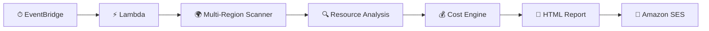
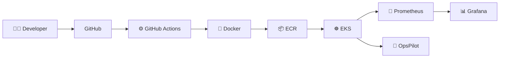
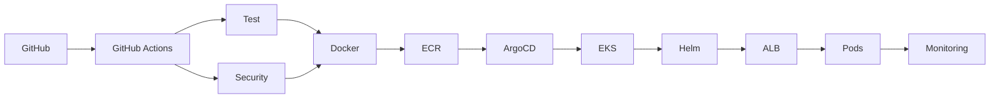
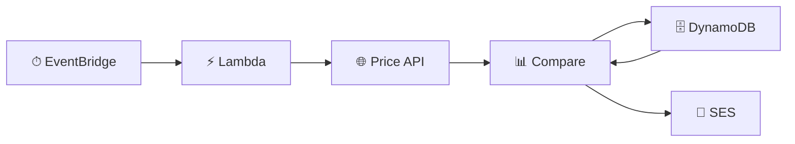
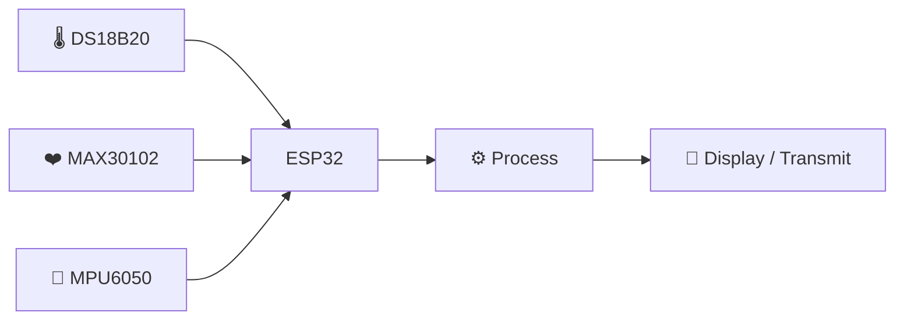
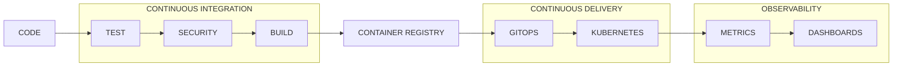

<!-- ===================================================== -->
<!--                 HARSHITH ROSUN W                       -->
<!--            DEVOPS • CLOUD • AUTOMATION                -->
<!-- ===================================================== -->

<!-- ================= ANIMATED HERO ================= -->

<p align="center">
  
</p>

<div align="center">


<br/>

<a href="https://github.com/harshithrosun2705-star">

</a>

<a href="https://www.linkedin.com/in/harshith-rosun-w-a3a29a305/">

</a>


</div>

<br/>

<!-- ================= NAVIGATION ================= -->

<div align="center">

### `./navigate`

[⚡ About](#-system-identity) •
[🛠 Arsenal](#-technology-arsenal) •
[🚀 Projects](#-mission-control) •
[🏗 Architecture](#-devops-engine) •
[📡 Telemetry](#-live-github-telemetry) •
[🐍 Activity](#-contribution-stream) •
[🤝 Connect](#-establish-connection)

</div>

---

# ⚡ System Identity

```console
harshith@devops:~$ whoami

Harshith Roshan
DevOps & Cloud Engineering

harshith@devops:~$ cat focus.txt

☁️  Cloud Infrastructure
⚙️  DevOps Automation
☸️  Kubernetes
🏗️  Infrastructure as Code
🔐  DevSecOps
📊  Observability
🐍  Python Automation

harshith@devops:~$ echo $MISSION

"Automate what can be automated.
 Build what can be reproduced.
 Observe what can fail.
 Secure what can be attacked."
```

<div align="center">

### Building systems from `git push` → `production`

</div>

```text
CODE
  │
  ▼
BUILD
  │
  ▼
TEST
  │
  ▼
SECURE
  │
  ▼
PACKAGE
  │
  ▼
DEPLOY
  │
  ▼
OBSERVE
  │
  ▼
IMPROVE
  └──────────────► ♻
```

---

# 🛠 Technology Arsenal

<div align="center">

### `cloud • infrastructure • containers • automation`


<br/><br/>


<br/>


</div>

<br/>

<details>
<summary><b>☁️ AWS Cloud Stack</b></summary>

<br/>

```text
COMPUTE
├── EC2
├── Auto Scaling
├── Lambda
└── EKS

NETWORKING
├── VPC
├── Public / Private Subnets
├── Route Tables
├── Internet Gateway
├── NAT Gateway
├── ALB
└── Security Groups

STORAGE / DATA
├── EBS
├── ECR
└── DynamoDB

SECURITY
├── IAM
├── IAM Roles
├── IAM Policies
├── IRSA
└── Secrets Manager

SERVERLESS / AUTOMATION
├── Lambda
├── EventBridge
├── SES
└── CloudWatch
```

</details>

<details>
<summary><b>☸️ Kubernetes & Cloud Native</b></summary>

<br/>

```text
Kubernetes
├── Pods
├── Deployments
├── ReplicaSets
├── Services
├── Ingress
├── ConfigMaps
├── Secrets
├── ServiceAccounts
├── RBAC
├── Liveness Probes
├── Readiness Probes
└── Horizontal Scaling

Platform
├── Amazon EKS
├── Amazon ECR
├── Helm
└── ArgoCD
```

</details>

<details>
<summary><b>⚙️ CI/CD & Automation</b></summary>

<br/>

```text
Git
├── GitHub
│   └── GitHub Actions
│
├── Jenkins
│
├── Docker
│
├── Terraform
│
└── GitOps
    └── ArgoCD
```

</details>

<details>
<summary><b>📊 Observability</b></summary>

<br/>

```text
Application / Cluster
        │
        ├── Prometheus ──► Metrics
        │
        ├── Grafana ─────► Dashboards
        │
        └── CloudWatch ──► AWS Monitoring
```

</details>

---

# 🚀 Mission Control

<div align="center">

## Selected Engineering Projects

`REAL-WORLD PROBLEMS` • `AUTOMATION` • `CLOUD` • `DEVOPS`

</div>

<br/>

<!-- ===================================================== -->
<!-- PROJECT 01 -->
<!-- ===================================================== -->

<details open>

<summary>

### 💰 01 · AWS Multi-Region Cost Optimization Platform ⭐

**FinOps • Serverless • Multi-Region AWS Automation**

</summary>

<br/>

<div align="center">


</div>

### `> mission`

Automatically inspect multiple AWS regions, detect potentially unused infrastructure and generate actionable cloud cost optimization reports.

### `> architecture`



### `> resources.scan()`

```text
🌍 Enabled AWS Regions
 │
 ├── EC2 Instances
 ├── EBS Volumes
 ├── EBS Snapshots
 ├── Elastic IPs
 ├── NAT Gateways
 └── Load Balancers
```

### `> detection`

```text
Stopped EC2          → Review compute cost
Unattached EBS       → Potential storage saving
Old Snapshots        → Review retention
Unused Elastic IP    → Potential release
Idle NAT Gateway     → Review network cost
Idle Load Balancer   → Review unnecessary LB
```

### `> pipeline`

```text
EVENTBRIDGE
     │
     ▼
LAMBDA
     │
     ▼
18 AWS REGIONS
     │
     ▼
RESOURCE DISCOVERY
     │
     ▼
COST ANALYSIS
     │
     ▼
HTML REPORT
     │
     ▼
SES EMAIL
```

### `> technologies`

`AWS Lambda` `Amazon EventBridge` `CloudWatch` `SES` `IAM`  
`Python` `Boto3` `FinOps` `HTML Reporting`

### `> engineering_value`

✅ Serverless architecture  
✅ Multi-region cloud automation  
✅ AWS API automation with Boto3  
✅ Cost optimization / FinOps  
✅ Event-driven architecture  
✅ Automated reporting

<br/>

<a href="https://github.com/harshithrosun2705-star/aws-multi-region-cost-optimizer">

</a>

</details>

---

<!-- ===================================================== -->
<!-- PROJECT 02 -->
<!-- ===================================================== -->

<details>

<summary>

### 🤖 02 · OpsPilot

**Kubernetes Self-Healing + Intelligent Troubleshooting Platform**

</summary>

<br/>

<div align="center">


</div>

### `> mission`

Deploy and operate containerized microservices using Kubernetes while combining:

```text
SELF-HEALING
      +
MONITORING
      +
CI/CD
      +
AUTOMATED TROUBLESHOOTING
```

### `> architecture`



### `> microservices`

```text
                    ┌───────────────┐
                    │    NGINX      │
                    │   FRONTEND    │
                    └───────┬───────┘
                            │
              ┌─────────────┼─────────────┐
              │             │             │
              ▼             ▼             ▼
        AUTH SERVICE    TASK SERVICE   ORDER SERVICE
          FastAPI
```

### `> kubernetes.self_heal()`

```text
Desired Replicas = 3

        POD
         ✓

        POD
         ✕

        POD
         ✓

          │
          ▼

ReplicaSet detects:
Desired = 3
Actual  = 2

          │
          ▼

      NEW POD

          │
          ▼

Healthy Replicas = 3
```

### `> opspilot.analyze()`

```text
CrashLoopBackOff
      │
      ├── Check container logs
      ├── Check application exit code
      ├── Check configuration
      └── Check health probes


ImagePullBackOff
      │
      ├── Verify image
      ├── Verify image tag
      ├── Check ECR access
      └── Check authentication


Pending
      │
      ├── Check node capacity
      ├── Check requests / limits
      ├── Check node selectors
      └── Check scheduling events
```

### `> technologies`

`Amazon EKS` `Amazon ECR` `Docker` `Kubernetes`  
`GitHub Actions` `Prometheus` `Grafana`  
`FastAPI` `Nginx` `Python` `Kubernetes Python SDK`

<br/>

<a href="https://github.com/harshithrosun2705-star/opspilot-kubernetes-platform">

</a>

</details>

---

<!-- ===================================================== -->
<!-- PROJECT 03 -->
<!-- ===================================================== -->

<details>

<summary>

### 🔐 03 · Production DevSecOps Cloud Platform

**AWS • Terraform • Kubernetes • GitOps • Security**

</summary>

<br/>

<div align="center">


</div>

### `> mission`

Build a production-style delivery platform where infrastructure, security and deployments are automated.

### `> architecture`



### `> secure_delivery`

```text
CODE
 │
 ▼
TEST
 │
 ▼
SCAN
 │
 ▼
BUILD
 │
 ▼
ECR
 │
 ▼
ARGOCD
 │
 ▼
EKS
 │
 ▼
OBSERVE
```

### `> security`

```text
IAM Least Privilege
IRSA
AWS Secrets Manager
Container Security Scanning
CI/CD Security Gates
Private Infrastructure
Terraform IaC
```

### `> technologies`

`AWS` `Terraform` `Docker` `Kubernetes` `EKS`  
`ECR` `GitHub Actions` `ArgoCD` `Helm`  
`Prometheus` `Grafana`

<br/>

<a href="https://github.com/harshithrosun2705-star/devsecops-cloud-platform">

</a>

</details>

---

<!-- ===================================================== -->
<!-- PROJECT 04 -->
<!-- ===================================================== -->

<details>

<summary>

### 🪙 04 · Gold & Silver Price Monitoring System

**AWS Serverless • Event Driven • API Automation**

</summary>

<br/>

<div align="center">


</div>

### `> mission`

Automatically fetch daily precious-metal prices, maintain historical data, calculate daily movements and deliver reports.

### `> architecture`



### `> data.pipeline`

```text
FETCH TODAY
    │
    ▼
READ YESTERDAY
    │
    ▼
COMPARE
    │
    ├── Difference
    ├── Increase
    └── Decrease
    │
    ▼
STORE TODAY
    │
    ▼
GENERATE REPORT
    │
    ▼
SEND EMAIL
```

### `> technologies`

`Lambda` `DynamoDB` `SES` `EventBridge` `CloudWatch`  
`Python` `Boto3` `urllib3` `REST APIs`

<br/>

<a href="https://github.com/harshithrosun2705-star/serverless-metal-price-monitor">

</a>

</details>

---

<!-- ===================================================== -->
<!-- PROJECT 05 -->
<!-- ===================================================== -->

<details>

<summary>

### ❤️ 05 · IoT Health Monitoring System

**ESP32 • Sensors • Embedded Systems • Real-Time Monitoring**

</summary>

<br/>

<div align="center">


</div>

### `> sensor.network`



### `> sensors`

```text
DS18B20
└── Body Temperature

MAX30102
├── Heart Rate
└── SpO₂

MPU6050
├── Motion
└── Fall Detection
```

### `> technologies`

`ESP32` `DS18B20` `MAX30102` `MPU6050`  
`Arduino IDE` `Embedded C` `IoT`

<br/>

<a href="https://github.com/harshithrosun2705-star/iot-health-monitoring">

</a>

</details>

---

# 🏗 DevOps Engine

<div align="center">

### `What happens after I push code?`

</div>



<div align="center">

`CODE` → `TEST` → `SECURE` → `BUILD` → `SHIP` → `DEPLOY` → `OBSERVE`

</div>

---

# 🧠 Engineering Mindset

```console
$ devops --principles

[01] Automate repetitive operations
[02] Infrastructure should be reproducible
[03] Git should describe desired state
[04] Security belongs inside the pipeline
[05] Systems must be observable
[06] Failures should be detectable
[07] Recovery should be automated
[08] Documentation is part of engineering
```

---

# 📡 Live GitHub Telemetry

<div align="center">


<br/>


<br/>


</div>

The cards above update from your GitHub activity rather than being manually entered. Profile-summary cards can also be generated through GitHub Actions if you later want everything self-hosted in your repository. :contentReference[oaicite:1]{index=1}

---

# 📈 Engineering Activity

<div align="center">


</div>

This uses the activity graph's current canonical deployment rather than the old discontinued Heroku/Cyclic endpoints. :contentReference[oaicite:2]{index=2}

---

# 🐍 Contribution Stream

<div align="center">

<picture>

<source
  media="(prefers-color-scheme: dark)"
  srcset="https://raw.githubusercontent.com/harshithrosun2705-star/harshithrosun2705-star/output/github-contribution-grid-snake-dark.svg"
/>

<source
  media="(prefers-color-scheme: light)"
  srcset="https://raw.githubusercontent.com/harshithrosun2705-star/harshithrosun2705-star/output/github-contribution-grid-snake.svg"
/>


</picture>

</div>

---

# 🔭 Current Coordinates

```yaml
currently_focused_on:

  cloud:
    - AWS
    - Architecture
    - Networking

  infrastructure:
    - Terraform
    - Infrastructure as Code

  containers:
    - Docker
    - Kubernetes
    - Amazon EKS

  delivery:
    - GitHub Actions
    - Jenkins
    - ArgoCD
    - Helm

  reliability:
    - Prometheus
    - Grafana
    - Kubernetes Troubleshooting

  security:
    - IAM
    - IRSA
    - Secrets Management
    - DevSecOps

  automation:
    - Python
    - Bash
    - Boto3
```

---

# 🌐 Engineering Universe

```mermaid
mindmap

root((HARSHITH))

  AWS
    Networking
    IAM
    Lambda
    EKS
    ECR
    DynamoDB

  DevOps
    CI/CD
    GitHub Actions
    Jenkins
    GitOps

  Containers
    Docker
    Kubernetes
    Helm

  Infrastructure
    Terraform
    IaC

  Observability
    Prometheus
    Grafana
    CloudWatch

  Security
    DevSecOps
    IAM
    IRSA
    Secrets

  Automation
    Python
    Bash
    Boto3

  Engineering
    Linux
    Networking
    Troubleshooting

```

---

# 🤝 Establish Connection

<div align="center">

### Interested in Cloud • DevOps • Kubernetes • Automation?

<br/>

<a href="https://www.linkedin.com/in/harshith-rosun-w-a3a29a305/">

</a>

<a href="https://github.com/harshithrosun2705-star">

</a>

<br/><br/>

```text
☁️ CLOUD
   +
⚙️ AUTOMATION
   +
☸️ KUBERNETES
   +
🔐 SECURITY
   +
📊 OBSERVABILITY

        │
        ▼

   RELIABLE SYSTEMS
```

### `Build. Automate. Secure. Observe. Improve.`

</div>

<!-- ================= ANIMATED FOOTER ================= -->

<p align="center">
  
</p>
